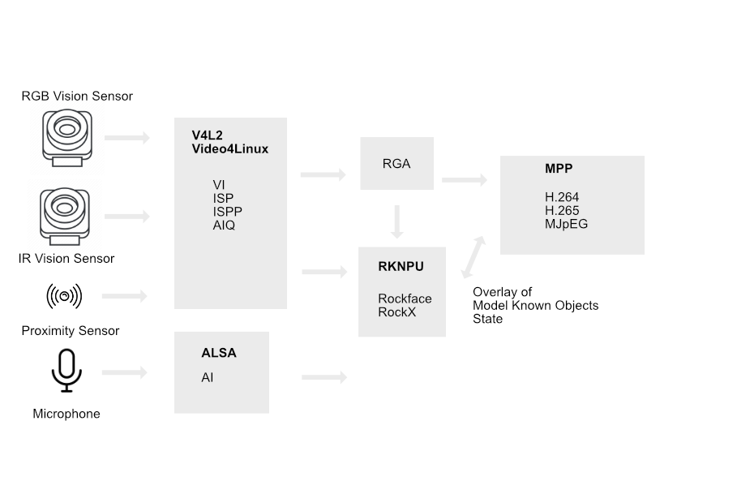

# Subcognition

The subcognition has inputs and produces outputs in the form of events.
The system is split in multiple processes that together interprets inputs from the outside world.

The Subcognition is distributed across systems some in the Occi some in Stem.

## Occi Subcognition

The Occi Subcognition is only active when visual input is expected. It is dormant if,

* Ziloo is sleeping (low battery / enforced times)
* Ziloo is resting (inactivity)

If Occi Subcognition is running, thereby involving the Tracker / Recogniser processes there is
a human present which has recently been active.
The typical distance of a person interacting is 10 - 100 cm away.

## Tracker and Recogniser Processes

The processes consume input from device drivers and provides interfaces over IPC.
The processes are kept alive by the system according to account configuration for the specific device.

Processes are active based on the [system Awakeness state](./AWAKENESS.md). Dependent on activity level some processes will not be responsive.

The same type of recogniser can run in multiple forms. 
For instance more than one human interaction recogniser can run at the same time resulting in voting, 
or one can be favored with the others recording their conclusions for the record for future review.

Types of processes:

* [Human Interaction Recogniser](./INTERACTION_RECOGNISER.md)
* Held Object Recogniser
* My Position Tracker
* Flat Illustration/Photo Recogniser

TODO
- Main Template
- DBus messages interface
- Persisting with Nano
- systemd config howto for processes
- Rust Programming template
- C++ Programming template
- DBus interface

## Inputs

Ziloo has two eyes with irises. In each eye a camera and one or more sensors are placed. 
Different types of eyes are used to broaden the inputs

The cameras are respectively an RGB Camera and an IR Camera. This allows for detecting photos of people.
It also gives detection options in low light situations.

[Video](./VIDEO.md) is fed from the two cameras.

A Proximity Sensor(Occi) can measure the distance to people and larger objects in front.

An Acceleration Sensor(Stem) is able to sense when Ziloo itself is being moved.

The cameras are controlled using Video4Linux. The input video is cropped according to the receiving strategy before being passed on. Ideally the cropping is set up in the sensor. Occasionally (4fps) uncropped frames are received to allow keeping track of developments outside the area of focus.
Modules involved VI, ISP, ISPP & AIQ. On Rockchip it seems that MPP [underlies this](https://github.com/rockchip-linux/mpp/blob/develop/doc/design/1.mpp_design.txt).

The microphone is fed into ALSA.

## Outputs

The Video input can be offered as an output over USB as a Video Gadget (UVC). It can be overlayed with identified objects. On Rockchip it is handled by [MPP](https://github.com/rockchip-linux/mpp).

The processes output events which are collated in an event log.

The system stores the recent event log locally and allows others to receive the events over the message bus.

## Model

The recognisers describe objects as apprearing and disappearing in the world

TODO Type of events that can occur
Types of objects

- Known Human
- Unknown Man, Woman, Child
- Estimated Age
- Unknown Hand
- Hand of known Human
- Generic Toy of <type>
- Known toy of <type>
- Known reference point

Verb / Qualification
- Moving <Direction deg>
- At location
- Conviction
- Present since
- 